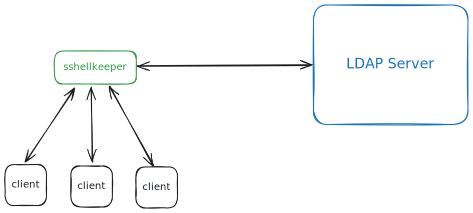

## sshellkeeper
`sshellkeeper` is an SSH server that is specialized for use as a game server. It allows multiple users to answer a set of CTF (Capture The Flag) challenges by logging in and make progress through the overall challenge.

### How it works
1. `sshellkeeper` server listens for SSH connections on a given host and port.
2. Once a user connects via SSH, their username is cross-checked using LDAP against an LDAP server containing the player's identity information.
3. The question they are currently on is sent to their SSH client and they are prompted for an answer.
4. The user's answer is validated against credentials in the LDAP server.
5. If the answer is correct, a suitable message is displayed, `sshellkeeper` promotes them to the next level and the session exits. The user can login again to get their next question or a message of completion should they have completed all the available questions. If the answer is incorrect, an appropriate message is displayed and the connection is terminated. The player can log in again to get their question and another opportunity to answer it.

### Wait, did you say LDAP??
Yes, with `sshellkeeper`, there is a unique approach to map game logic to an already solved problem - authentication and authorization.
The approach has the following mappings:
1. Players -> LDAP users
2. Levels -> LDAP groups
3. Question Content -> custom LDAP user Attribute
4. Answer Content -> custom LDAP user Attribute (combined with 3. above in a JSON string for easy serialization and deserialization)
5. Answer Correctness -> LDAP user's current password

### Deployment Architecture


#### Scaling
`sshellkeeper` is entirely stateless and depends on the LDAP server to handle persistence and all state. This makes it theoretically possible to horizontally scale the sshellkeeper service and place a reverse proxy loadbalancer to accept all incoming connections.

Scale limits of the LDAP server as as per the LDAP service used.

### Usage
Config file template:
```toml
[ldap]
host = "localhost:3890"
base_dn = "dc=example,dc=com"
admin_dn = "uid=gameadmin,ou=people,dc=example,dc=com"
username = "gameadmin"
password = "gameadmin"

# this section is specifically for the LLDAP server
[lldap]
web_host = "localhost:17170"
cli_path = "/root/lldap-cli/lldap-cli"

[game]
completion_password = "mysteriesoftheunknown"

[server]
host = "127.0.0.1"
port = "4001"
ssh_host_key_file = "./test-rsa"
```

Note: You can generate a new key pair using `ssh-keygen`.

### Some gotchas and TODOs
#### CLI for player promotion
While most of the interactions with the LDAP server are over LDAP, there is one use case which is achieved via different means. When a user successfully completes a question, their password is changed (to make it the answer of the next question) and their group membership is changed to indicate that they are authorized to see the next question. The awesome LDAP server we currently deploy (https://github.com/lldap/lldap) has a note in their docs indicating that group modifications are not supported by their server (https://github.com/lldap/lldap/blob/main/docs/scripting.md#ldap). Due to this, the current solution involves the use of another project that exposes a CLI (https://github.com/Zepmann/lldap-cli) that makes GraphQL queries to the LLDAP server to change group memberships.

In future, this is planned to be migrated to LDAP so it becomes possible to use any LDAP server which has support for custom attributes with `sshellkeeper`.

#### Tedious job of loading questions and answers
Serialized question and answer data is loaded per user into a multi-entry custom attribute. This is perfect as it allows users to potentially have different answers and perhaps even questions. However, this is a bit tedious. There is a need for an independent registration service that would use LDAP to create users with their attributes or update users' attributes.

### Contributing
External contributions are not welcome at this time as this is primarily an experimental project for learning and experimentation. Though, once the project reaches a certain stage, it may become open for contributions.

### References
https://blog.gopheracademy.com/advent-2015/ssh-server-in-go/
https://github.com/Zepmann/lldap-cli
https://github.com/lldap/lldap
